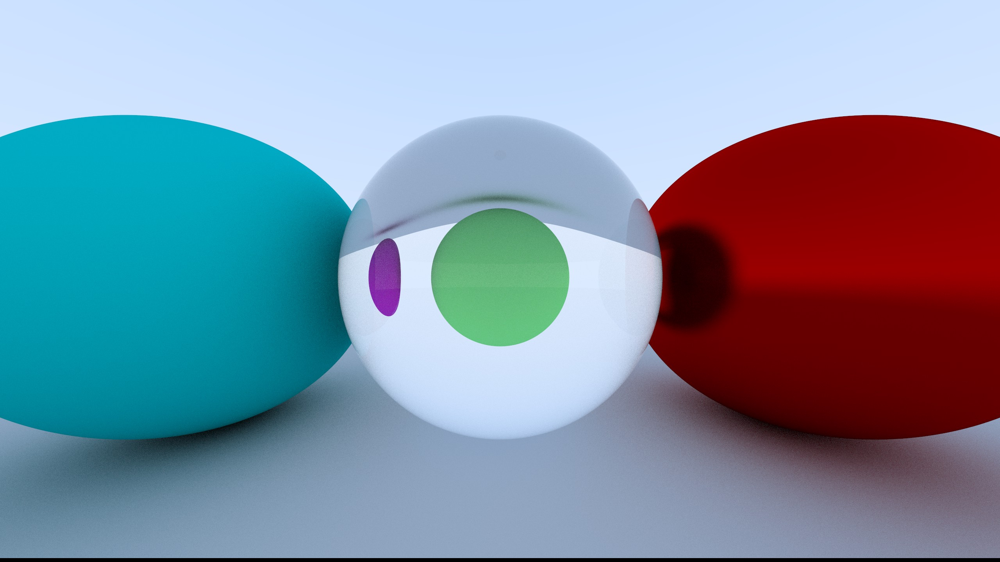
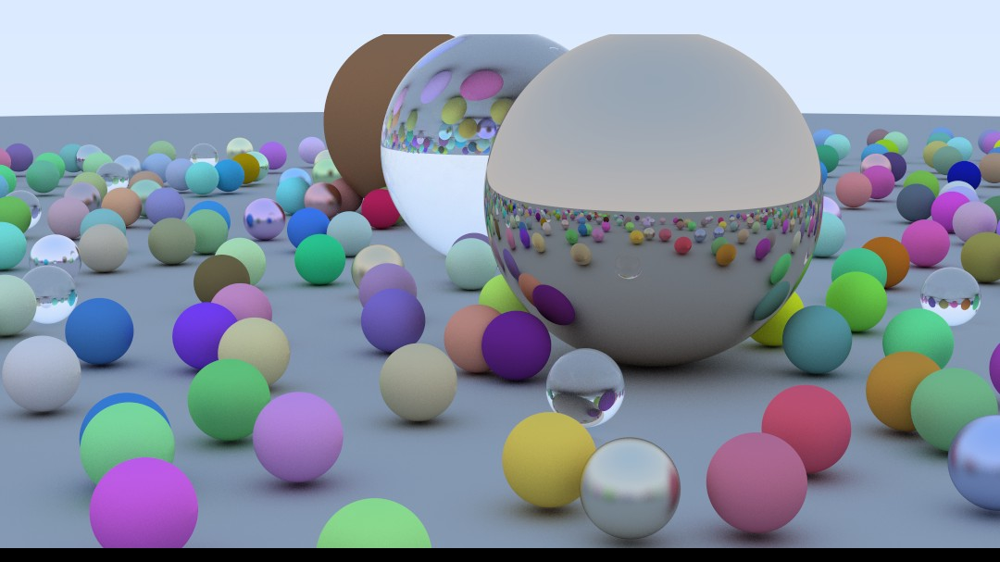

## Ray Tracer in Go
This ray tracer is written in pure Go, using goroutines for multithreading. The ray tracer was built following the [ray tracing in a weekend guide](https://raytracing.github.io/books/RayTracingInOneWeekend.html). Of course I have added my own spin on things, like adding multithreading and changing the structure of the project to fit not having classes.

## Images
Three spheres. Leftmost has a lambertian material (diffusion), middle has a dielectric material (with 1.5 refraction index), and rightmost has a red, fuzzy metal material.

The final product. Many different spheres with all four different materials.

There are still some small problems, but the core is finished.